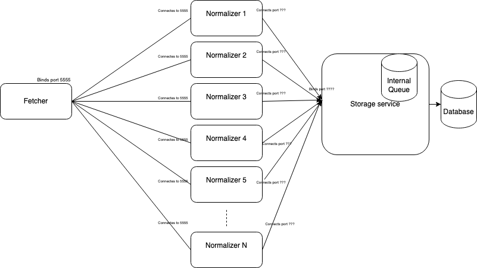

# Silk-Assignment

The assignment solution for fetching hosts from api clients and standardizing and storing them

## Installation

Requires docker to be installed.
Add your authorization key to `fetcher/.env` in the TOKEN.


```bash
docker-compose up --build -d
```

This will fire up 3 containers and start fetching from the rest endpoints:
1. Fetcher
2. Normalizer
3. Db

Fetcher will fetch the hosts from rest apis and forward it to a ZMQ socket.

Normalizer connects to the ZMQ socket and receives the data, normalizes it and adds to a async Queue.

An async task/method `Store()` reads from the queue and stores it to the Database.

The Store() function also check for duplicate data in the database before inserting, if exists then it merged the data and updates it.

I have also attached a jupyter notebook for code visualization demonstration.

##### You will need to have python and jupyter installed locally for it.

### Scaling

We can instantiate multiple copies of Normaliser service, that will run in parallel and consume huge amount of objects and normalize them for storing to database.
We can create a separate service for storage, which can connect to the normalizers through socket connection and store it to database.

A picture demonstrating the possible scaling of the solution is below.

